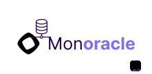
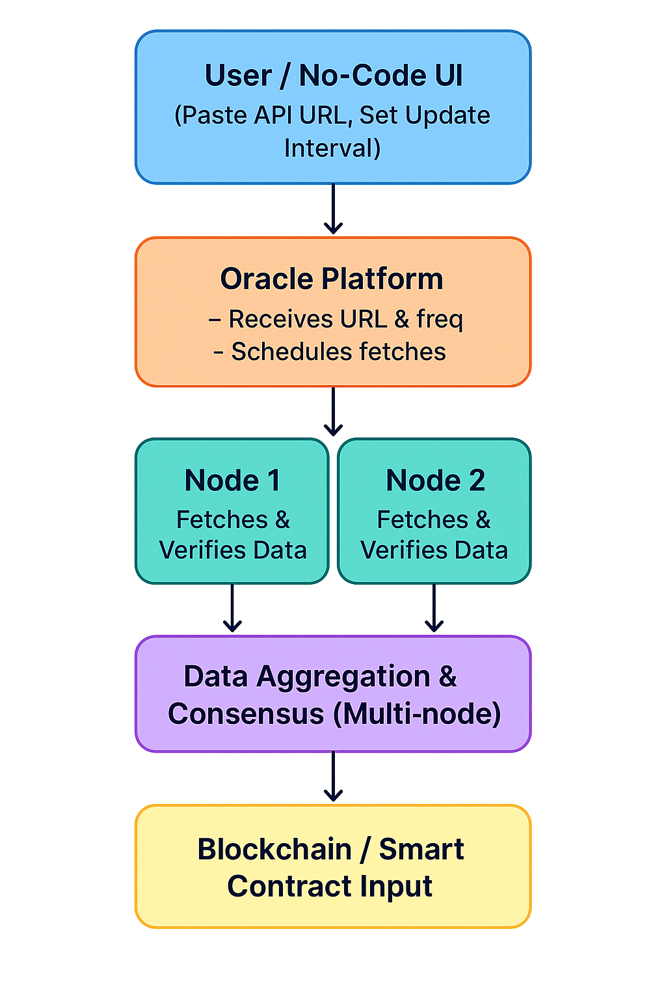

# Monoracle - No-Code Oracle Platform

> **Transform any API into a blockchain oracle in seconds - No coding required!**

Built for [Monad Blitz Hackathon](https://monad.xyz) - Leveraging parallel execution for blazing-fast oracle updates.

---

## What is Monoracle?

Monoracle is a **no-code oracle platform** that bridges the gap between real-world data and blockchain smart contracts. Simply provide an API URL and update interval, and Monoracle automatically fetches data and delivers it to your blockchain application.

### The Problem We Solve

Blockchains are isolated systems that can't access external data on their own. Traditional oracle solutions require:
- Complex smart contract development
- Manual data feeding infrastructure
- Expensive oracle service subscriptions
- Technical blockchain expertise

**Monoracle eliminates all of these barriers.**

---

## ⚡ Why Monad?

Built on **Monad**, a next-generation blockchain with **parallel execution** capabilities:

- **10,000+ TPS**: Process thousands of oracle updates per second **SIMULTANEOUSLY**
- **Lower Gas Fees**: Parallel execution means more efficient resource usage
- **Real-Time Updates**: No waiting in line - data is processed the moment it arrives
- **Multiple Oracles**: Run dozens of oracle feeds without network congestion

Unlike traditional blockchains that process one transaction at a time, Monad can handle multiple oracle updates **in parallel**, making your data feeds blazing fast and cost-effective.

---

### 1️⃣ No-Code Oracle Creation
- **Simple Form Interface**: Just paste your API URL and select update interval
- **Instant Deployment**: Oracle contract deployed to Monad testnet in seconds
- **MetaMask Integration**: Easy wallet connection and transaction signing

### 2️⃣ Automated Data Updates
- **Cron-based Updates**: Set intervals (10s, 1m, 10m, 1d, 5d)
- **API Fetching**: Automatically retrieves data from your chosen URL
- **On-Chain Storage**: Data stored immutably on blockchain
- **Verification History**: Every update is recorded with transaction hash

### 3️⃣ Real-Time Visualization
- **Interactive Map**: Visualize location data on maps (demo)
- **Live Updates**: Refresh data anytime with one click
- **Data Explorer**: View oracle details, history, and verification proofs

### 4️⃣ Transparent & Verifiable
- **Open Source**: All contract code is auditable
- **Verification Proofs**: Each update includes cryptographic proof
- **Explorer Integration**: Direct links to Monad block explorer

---

## 🏗️ Architecture

```
┌─────────────┐      ┌──────────────┐      ┌─────────────┐
│   User UI   │─────>│   Frontend   │─────>│   Wallet    │
│  (Next.js)  │      │  (React)     │      │ (MetaMask)  │
└─────────────┘      └──────────────┘      └─────────────┘
                             │
                             ↓
                     ┌──────────────┐
                     │  Smart       │
                     │  Contract    │──> Deployed to Monad
                     │  (Solidity)  │
                     └──────────────┘
                             ↑
                             │
                     ┌──────────────┐
                     │  External    │
                     │     API      │
                     └──────────────┘
```

### Smart Contract
- **Oracle.sol**: Main oracle contract with:
  - `createdBy`: Creator wallet address
  - `apiUrl`: Data source URL
  - `updateInterval`: Update frequency
  - `dynamicData`: Current oracle data
  - `verifications[]`: History of updates (txHash + data)
  - `isValidated`: Validation status
  - `MASTER_WALLET`: Backend wallet for automated updates

### Backend
- **API Routes**: Automated data fetching and contract updates
- **Cron Jobs**: Scheduled updates based on interval
- **Master Wallet**: Secure backend wallet for gas-free user experience

### Frontend
- **Next.js 15**: App Router with React Server Components
- **Tailwind CSS**: Utility-first styling
- **shadcn/ui**: Beautiful UI components
- **ethers.js**: Blockchain interactions

---

## 🚀 How It Works

### Step-by-Step Process

1. **Choose Your Data Source**
   - Provide any API URL (weather, stocks, sports scores, IoT data, etc.)
   - Example: `https://api.weather.com/today`

2. **Set Update Frequency**
   - Select how often the oracle should check for new data
   - Options: Every 10 seconds, 1 minute, 10 minutes, 1 day, 5 days

3. **Automatic Data Fetching**
   - Backend automatically retrieves data from your URL at specified intervals
   - Data is fetched from any REST API endpoint

4. **Data Delivery (Parallel Execution on Monad)**
   - Oracle sends data to blockchain
   - Thanks to **Monad's parallel execution**, multiple oracle updates are processed **at the same time**
   - Dramatically increases speed and reduces costs

5. **Smart Contract Usage**
   - Your smart contract can now use real-world data
   - Make decisions and execute actions based on live data

---

## 💡 Use Cases

### 🌤️ Weather Oracles
Create betting contracts for weather predictions
```
API: api.weather.com/today
Interval: Every day
Use: Automatically pay out winners based on actual weather data
```

### 📈 Price Feeds
Real-time cryptocurrency or stock prices
```
API: api.coingecko.com/price/ethereum
Interval: Every 10 seconds
Use: DeFi protocols, trading bots, price alerts
```

### 📍 Location Tracking
IoT device location updates
```
API: your-iot-device.com/location
Interval: Every 1 minute
Use: Supply chain tracking, asset management
```

### 🏆 Sports Results
Automated betting contract settlements
```
API: api.sportsdata.com/scores
Interval: Every 10 minutes
Use: Sports betting, fantasy leagues
```

---

## 🛠️ Tech Stack

- **Blockchain**: Monad Testnet
- **Frontend**: Next.js 15, React 19, TypeScript
- **Styling**: Tailwind CSS 4, shadcn/ui
- **Web3**: ethers.js v6

---

## 📦 Getting Started

### Prerequisites
- Node.js 18+
- MetaMask wallet
- Monad testnet configuration

### Installation

```bash
# Clone the repository
git clone https://github.com/yourusername/monoracle.git
cd monoracle

# Install dependencies
npm install
# or
yarn install

# Set up environment variables
cp .env.example .env.local
# Add your private key and RPC URL

# Run development server
npm run dev
```

### Environment Variables

```env
MONAD_RPC_URL=https://testnet.monad.xyz/rpc
MASTER_WALLET_PRIVATE_KEY=your_private_key_here
```

---

## 🎨 Primary Color

The platform uses **#836EF9** (purple) as the primary brand color, representing innovation and trust.

---

## 🔐 Security

- **Master Wallet**: Backend uses a dedicated master wallet for automated updates
- **Access Control**: Only master wallet can update oracle data
- **Verification Proofs**: Every update is cryptographically verified
- **Transparent**: All contract code is open source and auditable

---

## 📄 Smart Contract

### Oracle Contract Features
- ✅ Creator tracking (`createdBy`)
- ✅ API URL storage (`apiUrl`)
- ✅ Update interval configuration
- ✅ Dynamic data storage (JSON strings)
- ✅ Verification history with tx hashes

### Key Functions
- `updateData(string _newData)` - Update oracle data (master wallet only)
- `getOracleInfo()` - Get oracle metadata
- `getCurrentData()` - Get latest oracle data
- `getVerifications()` - Get all verification history

---

## 🤝 Contributing

We welcome contributions! Please feel free to submit a Pull Request.

---


## 🏆 Hackathon

Built with ❤️ for **Monad Blitz Hackathon** in Ankara

**Team**: Monoracle
**Focus**: Leveraging Monad's parallel execution for high-performance oracles

---

*Built on Monad - The Parallel Execution Blockchain* ⚡


